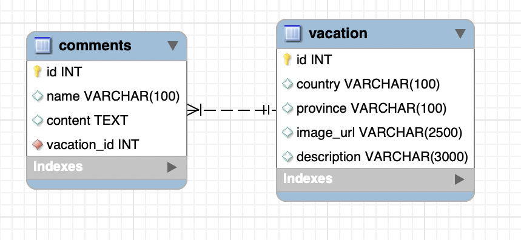

# EventTrackerProject

# Overview
My project is a vacation tracker. It will allow me to enter information about my past vacations with full CRUD using REST. This program will also let people comment on your vacation and tell you what they think about you. 
## Expected Routes
<table>
  <tr>
    <th><strong>Return Type</strong></th>
    <th><strong>Route</strong></th>
    <th><strong>Functionality</strong></th>
  </tr>
  <tr>
    <td><code>List< Vacation ></code></td>
    <td><code>GET api/vacations</code></td>
    <td>Gets all vacations</td>
  </tr>
  <tr>
    <td><code>Vacation</code></td>
    <td><code>GET api/vacations/{vacaId}</code></td>
    <td>Gets single vacation</td>
  </tr>
    <tr>
      <td><code>Vacation</code></td>
      <td><code>POST api/vacations</code></td>
    <td>Adds a single vacation</td>
  </tr>
    <tr>
      <td><code>Vacation</code></td>
      <td><code>PUT api/vacations/{vacaId}</code></td>
    <td>Updates a vacation</td>
  </tr>
     <tr>
       <td><code>boolean</code></td>
       <td><code>DELETE api/vacations/{vacaId}</code></td>
    <td>Deletes a vacation</td>
  </tr>
   <tr>
     <td><code>List< Comment ></code></td>
     <td><code>GET api/vacations/{vacaId}/comments</code></td>
    <td>Returns a list of comments for that vacation id.</td>
  </tr>
   <tr>
     <td><code>Comment</code></td>
     <td><code>POST api/vacations/{vacaId}/comments</code></td>
    <td>Add comment to a vacation by id</td>
  </tr>
   <tr>
     <td><code>void</code></td>
     <td><code>DELETE api/vacations/{vacaId}/comments/{commentId}</code></td>
    <td>Deletes a comment</td>
  </tr>
</table>

## Entity Relationship Model

## JSON Example
<code>
  {
  "country": "Netherlands",
        "province": "Amsterdam",
        "imageUrl": "https://cdn.britannica.com/30/180130-138-4FC01CDD/Overview-Amsterdam.jpg?w=800&h=450&c=crop",
        "description": "fun"
  }
  </code>

# Technologies Used
- RESTful Services
- Java
- Spring
- Hibernate
- Spring Data JPA
- Spring Boot
- MySQL 
- Postman

# Lessons Learned
This week I solidified my JPA knowledge by building entities for this project. I used a REST service to access database objects. I also solidified my understanding on HTTP Requests/Responses. Testing in Postman was pretty simple.
